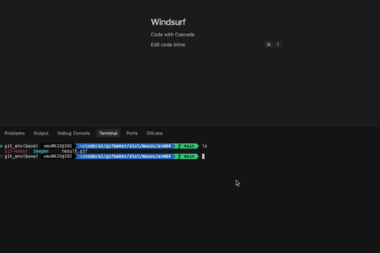

# GIF Maker

将多张图片或视频片段合并成一张GIF动态图片的跨平台工具。

## 功能特点

- 将多张图片合并成一张GIF动态图片
- **支持从视频文件提取片段制作GIF**
- 支持设置帧延迟时间
- 支持多种图片格式
- **支持将不同大小的图片调整为统一大小**
- 跨平台支持：Windows、macOS Intel、macOS ARM架构和Linux

## 使用方法

### 命令行使用

#### 从图片创建GIF

```bash
# 基本用法
./gif-maker images -i 图片目录 -o 输出文件名.gif -d 帧延迟(毫秒)

# 示例
./gif-maker images -i ./images -o output.gif -d 200

# 使用不同的文件匹配模式
./gif-maker images -i ./images -o output.gif -d 200 -p "*.jpg"

# 调整图片大小后创建GIF
./gif-maker images -i ./images -o resized.gif -d 200 -r -w 800 --height 600

# 使用填充模式（默认）
./gif-maker images -i ./images -o filled.gif -d 300 -r -w 250 --height 500 -k

```


```bash
# 使用居中模式
./gif-maker images -i ./images -o centered.gif -d 300 -r -w 250 --height 500 -k --fill-mode center
```


```bash
# 向后兼容的旧语法（不推荐）
./gif-maker -i ./images -o output.gif -d 100
```

#### 从视频创建GIF

```bash
# 基本用法 - 提取整个视频
./gif-maker video -i input.mp4 -o output.gif

# 提取视频的特定片段（5秒到10秒）
./gif-maker video -i input.mp4 -o clip.gif -s 5 -e 10

# 调整帧率和大小
./gif-maker video -i input.mp4 -o video_clip.gif -f 10 -r -w 480 --height 320

```

原始视频：

<video src="docs/images/video.mp4" controls width="30%"></video>

生成的GIF：



### 参数说明

#### 通用参数
- `-o, --output`: 输出GIF文件路径（必需）
- `-r, --resize`: 是否调整图片大小
- `-w, --width`: 调整后的图片宽度
- `--height`: 调整后的图片高度
- `-k, --keep-aspect-ratio`: 是否保持原始宽高比，默认为是

#### 图片模式参数
- `-i, --input`: 输入图片目录（必需）
- `-d, --duration`: 每一帧的延迟时间，单位为毫秒，默认为100
- `-p, --pattern`: 文件匹配模式，默认为"*.png"

#### 视频模式参数
- `-i, --input`: 输入视频文件路径（必需）
- `-s, --start`: 开始时间，单位为秒，默认为0
- `-e, --end`: 结束时间，单位为秒，默认为视频结束
- `-f, --fps`: 每秒提取的帧数，默认为10
- `-d, --duration`: 每一帧的延迟时间，单位为毫秒，默认根据fps自动计算

## 安装说明

本工具提供了预编译的可执行文件，无需安装Python或其他依赖即可使用。

> **注意**：视频处理功能需要安装OpenCV库。如果使用预编译版本，该依赖已包含在内。如果从源码运行，需要额外安装 `opencv-python` 包。

### Windows

下载`windows`目录中的`gif-maker.exe`文件，双击运行或通过命令行使用。

### macOS Intel (x64)

下载`macos/x64`目录中的`gif-maker`文件，通过终端使用：

```bash
chmod +x gif-maker
./gif-maker -i 图片目录 -o 输出文件名.gif
```

### macOS ARM (Apple Silicon)

下载`macos/arm64`目录中的`gif-maker`文件，通过终端使用：

```bash
chmod +x gif-maker
./gif-maker -i 图片目录 -o 输出文件名.gif
```

### Linux

下载`linux`目录中的`gif-maker`文件，通过终端使用：

```bash
chmod +x gif-maker
./gif-maker -i 图片目录 -o 输出文件名.gif
```

## 从源代码构建

如果您想从源代码构建可执行文件，请按照以下步骤操作：

1. 安装Python 3.13或更高版本
2. 创建并激活虚拟环境：

```bash
# 创建名为git_env的虚拟环境
python3 -m venv git_env

# 在Windows上激活虚拟环境
# git_env\Scripts\activate

# 在macOS/Linux上激活虚拟环境
source git_env/bin/activate
```

3. 安装依赖：
   ```bash
   # 基本功能
   pip install Pillow
   
   # 视频处理功能（可选）
   pip install opencv-python
   
   # 或者直接安装所有依赖
   pip install -r requirements.txt
   ```

4. 运行构建脚本：`python build.py`
5. 完成后可以退出虚拟环境：`deactivate`

构建完成后，可执行文件将位于`dist`目录中。

使用虚拟环境可以确保项目依赖不会与系统Python环境冲突，并且便于管理项目特定的依赖包。

## 使用GitHub Actions自动发布

本项目配置了GitHub Actions工作流，可以自动构建并发布跨平台的可执行文件。

### 发布新版本

#### 方法一：使用脚本发布

1. 确保所有代码变更已提交到仓库
2. 使用提供的发布脚本创建新版本：

```bash
# 发布版本1.0.0
./release.sh 1.0.0
```

3. 脚本会创建标签并推送到GitHub，触发GitHub Actions工作流

#### 方法二：使用GitHub网页手动触发

1. 在GitHub仓库页面上，点击“Actions”标签
2. 在左侧工作流列表中，选择“Build and Release”
3. 点击“Run workflow”按钮
4. 输入版本号（例如：1.0.0），并选择是否为预发布版本
5. 点击“Run workflow”开始构建

#### 构建结果

GitHub Actions将自动构建四种平台版本的可执行文件：
- Windows
- macOS Intel (x86_64)
- macOS Apple Silicon (ARM64)
- Linux

构建完成后，可执行文件将自动上传到GitHub Releases页面

### 工作流说明

- 工作流配置文件位于`.github/workflows/build-and-release.yml`
- 工作流可通过两种方式触发：
  - 推送以`v`开头的标签时自动触发（例如`v1.0.0`）
  - 在GitHub Actions页面上手动触发，并指定版本号
- 工作流会并行构建四种平台版本的可执行文件，包括两种macOS架构（Intel和Apple Silicon）
- 工作流使用依赖缓存机制，显著减少重复安装时间，提高构建速度
- 缓存基于`requirements.txt`文件的哈希值，当依赖项变化时才会重新安装
- 构建完成后，工作流会创建一个新的GitHub Release并上传所有可执行文件


## 赞赏码

|                     **支付宝**                     |                     **微信支付**                     |
| :------------------------------------------------: | :--------------------------------------------------: |
|  |  |

## 许可证

本项目采用 MIT 许可证 - 详见 [LICENSE](LICENSE) 文件。