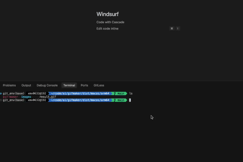

# 一个简单免费的GIF制作工具：GifMaker

最近在写公众号文章《AI使用实战：产品经理的助手-原型设计篇》的时候，我突然想到一个需求：图片太多的排起来太难看，能不能把一组图片快速拼接成GIF动图？搜索了一下，发现有些专业的付费工具有这个功能，但操作复杂且价格不菲。

于是，我就临时使唤AI开发了一个小工具GifMaker。

它是一个非常简单但功能强大的工具，主要用来将一组本地图片或视频片段合成为动态GIF。

一开始它只是一个短小的Python脚本，第一次运行就成功生成了一个gif图片。随着不断完善，现在它已经支持调整图片大小、保持宽高比、从视频创建GIF等更多实用功能。

为了让它更方便使用，我把它打包成了跨平台的可执行文件，这样即使你没有安装Python环境，也能在Windows、macOS或Linux上轻松运行。

如果你对制作GIF感兴趣，不妨看看这个小工具，说不定它能帮到你！

## GifMaker是什么？

GifMaker是一个轻量级的开源工具，功能纯粹而强大：只需要把图片放在指定的本地目录下，或者选择一个视频文件，设置切换时间和其他参数，运行一条命令就能生成一张动态GIF图片。

无论是技术小白还是开发者，都可以轻松上手这个工具。最新版本不仅支持将不同大小的图片调整为统一大小，还新增了从视频文件直接创建GIF的功能，让你可以轻松将视频片段转换为动态GIF。

## 它有哪些特点？

### 1. 轻量又强大 

GifMaker的核心功能非常专注：将图片序列变成GIF。它没有复杂的界面，也没有多余的功能，专注于解决"快速生成高质量GIF"这一需求。同时，它提供了多种参数设置，满足不同场景的需求。

### 2. 完全本地化操作  

不需要上传图片，也不依赖网络。你只需要把图片放到工具指定的文件夹里，运行工具即可。所有的处理都在你的电脑上完成，速度快，隐私也有保障。

### 3. 支持设置切换时间

你可以通过参数设置每张图片的显示时间（即切换间隔）。这个设置可以让你控制动图的速度，比如让画面切换得更快或更慢，默认为100毫秒。

### 4. 支持调整图片大小

现在GifMaker支持将不同大小的图片调整为统一大小，可以指定目标宽度和高度，还可以选择是否保持原始宽高比。这解决了制作GIF时常见的图片尺寸不一致问题。

### 5. 支持从视频创建GIF

GifMaker现在支持从视频文件直接创建GIF动图！你可以指定视频的开始和结束时间，设置每秒提取的帧数，轻松将视频片段转换为高质量的GIF。这个功能特别适合从视频中提取精彩片段制作表情包或演示动画。

### 6. 跨平台支持

GifMaker已打包成各种平台的可执行文件（Windows、macOS Intel、macOS ARM架构和Linux），你不需要安装Python环境，也无需任何额外配置，直接下载对应平台的版本就能运行。

### 7. 开源免费  

GifMaker的代码托管在GitHub上，采用开源协议，任何人都可以下载、使用甚至修改它。

## 如何使用GifMaker？

使用GifMaker的过程非常简单，以下是具体步骤：

### 1. 准备图片素材

首先，准备好你需要制作GIF的图片素材。这些图片可以是你拍摄的一组连拍照片，也可以是从其他地方提取的画面帧。注意，图片的命名顺序会影响最终的动态效果，最好按时间顺序排列好。

### 2. 放入指定目录  

将图片素材放到一个文件夹中，例如`images`。

### 3. 使用命令行

GifMaker现在支持两种模式：从图片创建GIF和从视频创建GIF。

#### 从图片创建GIF

```bash
./gif-maker images -i images -o result.gif -d 1000 -p "*.png"
```

这条命令的意思是：从`./images`文件夹读取所有PNG图片，设置每张图片显示1秒（1000毫秒），生成一张GIF动图，并保存为`result.gif`。

#### 调整图片大小
```bash
./gif-maker images -i images -o resized.gif -d 200 -r -w 800 --height 600
```

这条命令会先将所有图片调整为800×600的大小，然后生成GIF，每张图片显示0.2秒。


#### 使用填充模式

```bash
./gif-maker images -i images -o filled.gif -d 300 -r -w 250 --height 500 -k
```


这条命令会将图片调整为250×500的大小，并默认使用“填充”模式确保图片完全填满指定尺寸，不会有空白区域。这种模式会在保持宽高比的同时，对图片进行适当裁剪，以确保填满整个画面。

如果想要使用居中放置模式（可能有空白区域），可以指定 `--fill-mode center` 参数：
```bash
./gif-maker images -i images -o centered.gif -d 300 -r -w 250 --height 500 -k --fill-mode center
```


#### 从视频创建GIF
```bash
./gif-maker video -i video.mp4 -o video_clip.gif -s 5 -e 10 -f 10 -r -w 480 --height 320
```

这条命令会从`video.mp4`视频的第5秒到第10秒提取帧，每秒提取15帧，调整为480×320的大小，然后生成GIF动图。

原始视频：

<video src="images/video.mp4" controls width="30%"></video>


生成的GIF：



#### 图片模式参数说明

- `-i, --input`: 输入图片目录（必需）
- `-o, --output`: 输出GIF文件路径（必需）
- `-d, --duration`: 每一帧的延迟时间，单位为毫秒，默认为100
- `-p, --pattern`: 文件匹配模式，默认为"*.png"
- `-r, --resize`: 是否调整图片大小
- `-w, --width`: 调整后的图片宽度
- `--height`: 调整后的图片高度
- `-k, --keep-aspect-ratio`: 是否保持原始宽高比，默认为是
- `--fill-mode`: 填充模式，当保持宽高比时的处理方式，可选值：
  - `fill`: 缩放并裁剪，确保填满整个画面（默认）
  - `center`: 居中放置，周围可能有空白

#### 视频模式参数说明

- `-i, --input`: 输入视频文件路径（必需）
- `-o, --output`: 输出GIF文件路径（必需）
- `-s, --start`: 开始时间（秒），默认为0
- `-e, --end`: 结束时间（秒），默认为视频结束
- `-f, --fps`: 每秒提取的帧数，默认为10
- `-d, --duration`: 每一帧的延迟时间（毫秒），默认根据fps自动计算
- `-r, --resize`: 是否调整图片大小
- `-w, --width`: 调整后的图片宽度
- `--height`: 调整后的图片高度
- `-k, --keep-aspect-ratio`: 是否保持原始宽高比，默认为是
- `--fill-mode`: 填充模式，当保持宽高比时的处理方式，可选值：
  - `fill`: 缩放并裁剪，确保填满整个画面（默认）
  - `center`: 居中放置，周围可能有空白

### 4. 查看结果

工具运行完成后，你会在指定的输出路径找到生成的GIF文件。如果对效果不满意，可以调整参数重新生成。

## 总结

GifMaker是一个简单而强大的GIF制作工具，适合各类用户使用。无论你是产品经理需要制作演示动图，设计师需要展示动态效果，还是普通用户想把照片或视频片段制作成动态回忆，GifMaker都能帮你轻松完成。

最新版本不仅保留了调整图片大小的功能，还增加了从视频创建GIF的重要新功能，让你可以轻松从视频中提取精彩片段并转换为高质量GIF动图。这大大扩展了工具的应用场景，无论是制作表情包、演示动画，还是将精彩视频片段转为GIF分享，都变得更加简单。

该工具已打包成各平台的可执行文件，无需安装Python环境，下载后即可使用。它完全开源免费，欢迎大家使用和贡献代码。

如果你对这个工具有兴趣，欢迎去GitHub上下载源码或可执行文件。如果有任何建议或想法，也欢迎反馈，我会继续完善它！

---

## 下载信息

- github

  - 项目地址 github：https://github.com/xmx0632/gifmaker
  - 下载地址 github：https://github.com/xmx0632/gifmaker/releases


- gitee
  - 项目地址 gitee：https://gitee.com/xmx0632/gifmaker
  - 下载地址 gitee：https://gitee.com/xmx0632/gifmaker/releases

支持平台：Windows、macOS Intel、macOS ARM架构和Linux